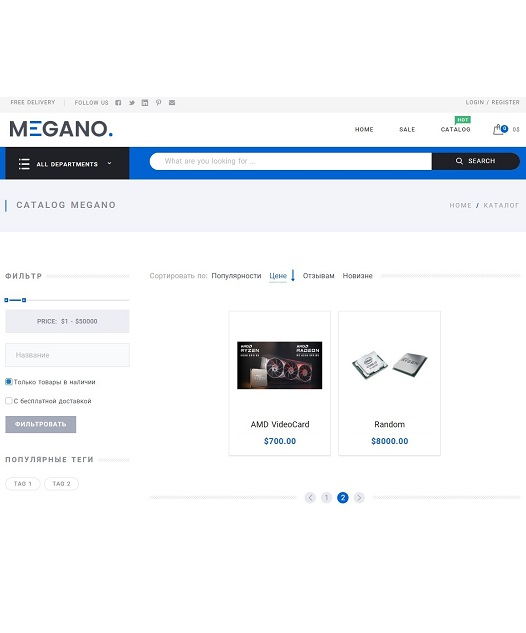

# Online-Store

Online store made with Django framework where clients can register and buy cataloged items. Items to be sold can be
added from django admin panel. There are options to sort products based on price, date, rating, there are separate tags
for products and limited time offers. Comments can be left on catalog items and average rating will be calculated.

## Installation

Use the package manager [pip](https://pip.pypa.io/en/stable/) to install poetry, then use poetry to install all
dependencies.

```bash
pip install poetry
poetry install
```

Before use, you need:

1. Fill in  ".env.template" and rename it to ".env"

You are all set to go!

## This is how it looks



## Usage

Site is ready for deployment on a hosting server with docker using gunicorn for more information refer to Dockerfile and
docker-compose.yaml.

## Contributing

Pull requests are welcome.

## License

[MIT](LICENSE.txt)